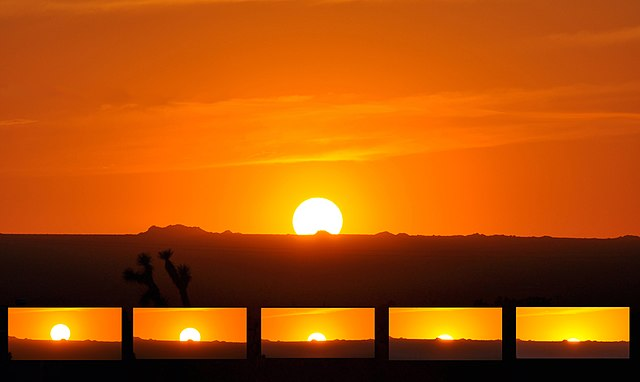
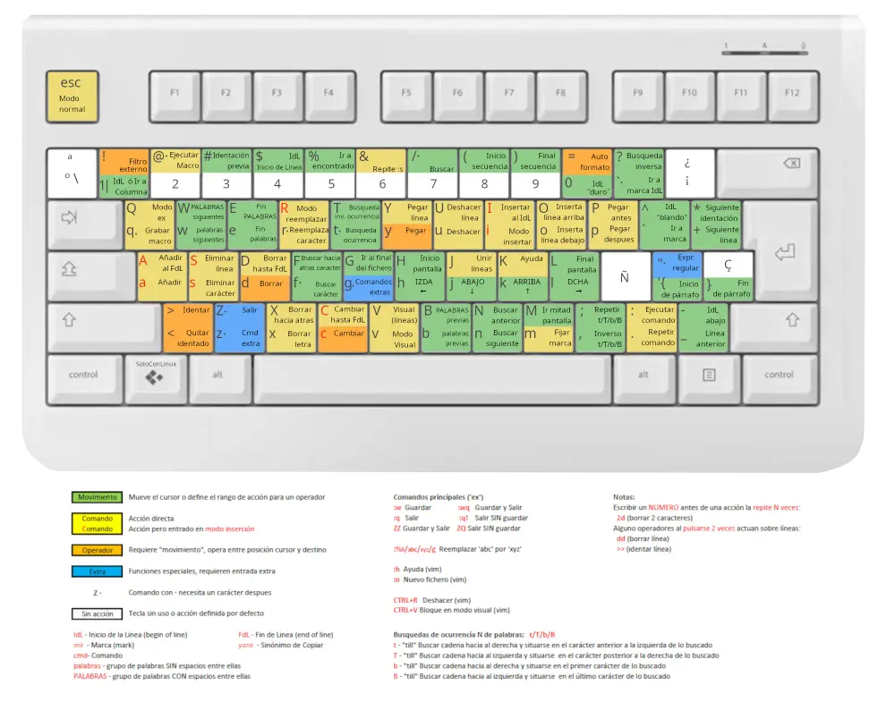

+++
date = '2024-10-21T23:09:04+02:00'
draft = false
menus = 'main'
title = 'About - Submenu'
+++

{width="200" alt="Gravel Calls" class="center"}



Hola mundo  

Salto de *linea* 

Otro mas

My name is The Dude. I have the following qualities:

- I rock a great beard
- I'm extremely loyal to my friends
- I like bowling

That rug really tied the room together.

### my history

To be honest, I'm having some trouble remembering right now, so why don't you
just watch [my movie](https://en.wikipedia.org/wiki/The_Big_Lebowski) and it
will answer **all** your questions.

